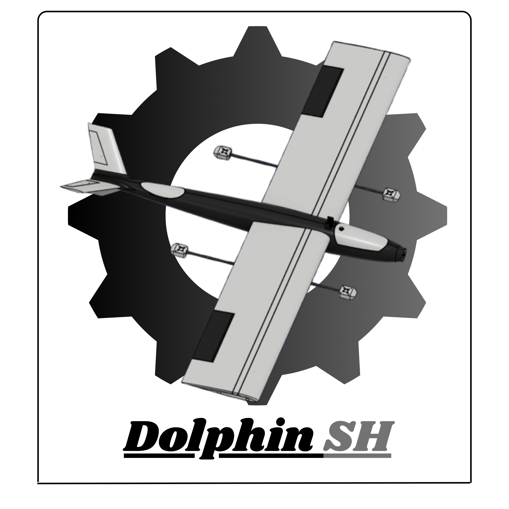

# VTOL FPV Fixed-Wing UAV Project

 
   

discord server : https://discord.gg/rtFu4ADm9m
## Overview

This project is a 3d printed VTOL (Vertical Take-Off and Landing) fixed-wing UAV with FPV (First Person View)  
It combines quad lift motors for vertical flight ( kinda like a drone ) but with a additional forward propulsion motor for efficient cruise.
I built this project to learn how to properly design, build a UAV (Unmanned Aerial Aircraft)

---

## Plane Features

- High-wing configuration
- 3d printed fuselage and wings (97% of the plane is 3d printed)  
- Quad vertical lift motors for VTOL capability  
- Nose-mounted motor for cruise propulsion  
- V tail configuration  
- Back fin designed for stability in forward flight at moderate speed
- easy access for mounting servo in the fuselage thanks to a BWD CAN and a FWD canopy

---

## Design Objectives
i made it to be or have : 
- Stable hover and smooth transition to forward flight  
- High structural stiffness with minimal weight  
- Efficient cruise performance  
- Predictable aerodynamic behavior at low Reynolds numbers  
- Modular fuselage for maintenance and upgrades  

---

## Technical Specifications 

- **Wingspan:** 1300mm
- **Wing Area:** 0.286 m²
- **Wing loading:** 59 g/dm²
- **estimated stall speed:** 26 km/h ( quite high but its understandable since you have 4 unused motor on your wing ) 
- **Airfoil:** SS ( Semi-Symmetrical)
- **Estimated Weight:** 2046.458g  
- **Lift Motors:** 4 × A2212 
- **Cruise Motor:** 1 × A2212
- **Battery:** 3s 2200mah 30C ( estimated flight time: 17min )  
- **Flight Controller:** DakeFpv f722 X6 ( any flightcontroller will work )

---

## Firmware

the Firmware thats going to run is Inav its a lighweight program that is capable of autonomously fly the uav to pre-programmed waypoint or loiter ( always wanted to do this imagine letting go of the transmitter and the plane continue to fly itself thats literally magic ) 

---
## FAQ

**Q: Can this plane really hover like a drone?**  
A: Yes, the quad lift motors provide vertical takeoff and stable hover.

**Q: How difficult is the hover-to-cruise transition?**  
A: It’s one of the trickiest parts. Proper PID tuning in iNav and smooth throttle control are key to avoiding instability.

**Q: Can I use a different flight controller?**  
A: Yes, any controller that supports VTOL and iNav or Ardupilot firmware should work (and have 8 signal pins), though wiring and mounting may need adjustments. 

**Q: How long does it take to assemble?**  
A: Printing and assembly can take several days (or weeks!), depending on your 3D printing setup and experience. 

**Q: Is it possible to carry a camera payload?**  
A: Small FPV cameras work fine. =)

**Q: Can I scale the design larger or smaller?**  
A: Yes, but aerodynamics and weight distribution change with scale. Lift motors may need different thrust ratings.

**Q: How do you troubleshoot vibrations from the motor arms?**  
A: good carbon fiber tube is enough check for any error in the manufacturing side

**Q: How safe is the plane for beginners?**  
A: It’s moderately advanced. Beginners should test hover flights in a wide, open area and start with short, low-altitude hops.

**Q: What kind of maintenance is required?**  
A: Regularly check motor screws, propeller condition, and servo linkages. easy access panels in the fuselage makes replacing parts faster.

**Q: Can the firmware do autonomous flight?**  
A: Yes, iNav can handle waypoint navigation and loitering, letting the plane fly itself once configured correctly.

---

## COOL Pics

-

-

-

THATS SO SLICK
-

-
Render

---

## Engineering Challenges

- Drag from exposed lift motors during cruise  
- Structural vibration and resonance of motor arms  ( simulation ) 
- Stable hover-to-cruise transition ( hard ) 
- Accurate CG placement ( moderate ) 

---

## BoM ( secret sauce!!) 
 
| Component | Specification | Quantity | Price  | Link    |
|-----------|--------------|----------|---------|---------|
| set of motor, esc and propellers        |    A2212 1000KV / 30amp esc / 23cm props         |  4        |    61.41$     |     https://a.aliexpress.com/_EJaQqYY   |
|     FPV    |    camera with vtx and google          |    1      |  87.58$       |  https://a.aliexpress.com/_EuSo3te      |  
|    Telemetry      |      lora LR02 ASR6601 (10km range)      |   1    |       25.62$  |     [https://a.aliexpress.com/_EJKOflA](https://a.aliexpress.com/_EJNQwhK)    |   
|     Servo      |      sg90   (180deg)    |    10      |   15.65$      |   https://a.aliexpress.com/_EHJRpG8      | 
|       Carbon Fiber tube    |     9x7x500mm         |    6     |    40.83$     |       https://a.aliexpress.com/_EH2rwjI  | 
|    Servo Rods       |       19cm 1.2mm       |    50      |       7.55$  |     https://a.aliexpress.com/_EJKOflA    |   
|    Copper wire (for signal and fc)     |       10m (24awg) yellow    | 1     |       4.6$  |    [ https://a.aliexpress.com/_EzUnszi)  ](https://a.aliexpress.com/_EzUnszi)  |  
|    Copper wire (for batteries)       |       5m (18awg) black     |   1      |       5.36$  |    [ https://a.aliexpress.com/_EJKOflA](https://a.aliexpress.com/_EztPdHO)    |   
|    3D printing       |   2046.458g   PLA    |   1    |       150$  |     3d printing service (1g=0.11$) i will pay the rest from my pockets |  

i already own 1 flightcontroller , 1 motor , 1 esc , 1 battery, 1 gps , 1 receiver and transmitter 

### the TOTAL : 398.6$ 
i tried to reduce cost as much but 3d printing literally is so expensive in morocco if i order from internationnal manufacturer i get hit with the tax and shipping cost i believe this is the cheapest choice that i have 

## Credits

A big thanks to Hackclub and Blueprint for making this possible without them, all these project would been just a .step file 
 
also i want to thank the Reviewers who are doing an incredible job, kudos !

---
## Disclaimer

 

This project is experimental and intended for research and educational purposes.  
All flight testing must be conducted in safe and controlled environments.
