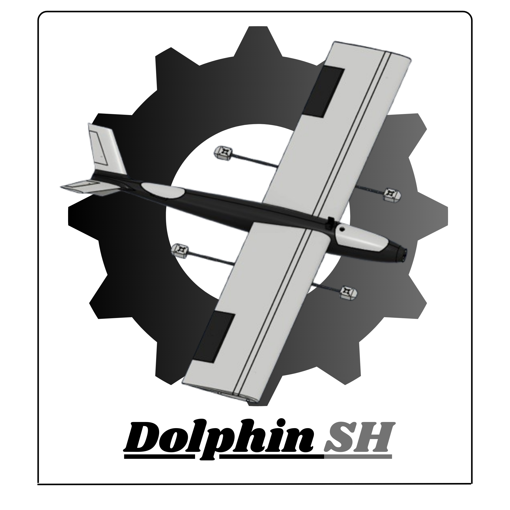
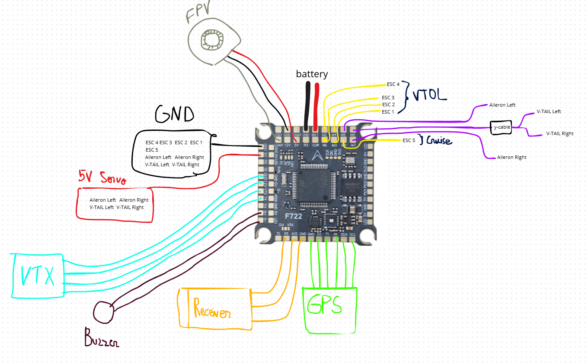
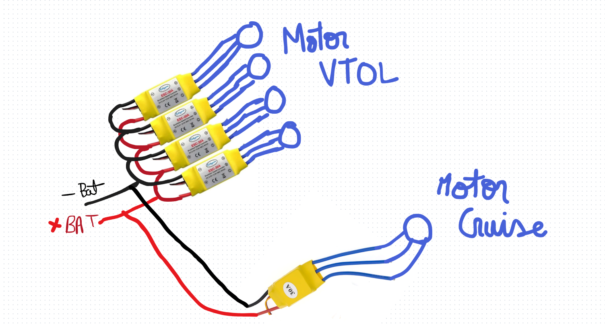

# VTOL FPV Fixed-Wing UAV Project

 
   

### discord server : https://discord.gg/rtFu4ADm9m

## Overview

This project is a 3d printed VTOL (Vertical Take-Off and Landing) fixed-wing UAV with FPV (First Person View)  
It combines quad lift motors for vertical flight ( kinda like a drone ) but with a additional forward propulsion motor for efficient cruise.
I built this project to learn how to properly design, build a UAV (Unmanned Aerial Aircraft)

---

## Plane Features

- High-wing configuration
- 3d printed fuselage and wings (97% of the plane is 3d printed)  
- Quad vertical lift motors for VTOL capability  
- Nose-mounted motor for cruise propulsion  
- V tail configuration  
- Back fin designed for stability in forward flight at moderate speed
- easy access for mounting servo in the fuselage thanks to a BWD CAN and a FWD canopy

---

## Design Objectives
i made it to be or have : 
- Stable hover and smooth transition to forward flight  
- High structural stiffness with minimal weight  
- Efficient cruise performance  
- Predictable aerodynamic behavior at low Reynolds numbers  
- Modular fuselage for maintenance and upgrades  

---

## Technical Specifications 

- Wingspan: 1300 mm

- Wing Area: 0.286 m²

- Aspect Ratio: 5.9

- Wing Loading: 7.0 kg/m² (≈ 68.5 N/m²)

- Estimated Stall Speed: ~35 km/h (≈ 9.7 m/s)

- Cruise Speed (est.): ~72 km/h (20 m/s)

- Cruise Lift Coefficient (CL @ 20 m/s): ~0.28

- Reynolds Number (@ cruise): ~300,000

- Airfoil: Semi-Symmetrical (Cambered SS)

- Estimated Weight: 2046 g (~20 N)

- Fuselage Length: 888 mm

- Max Fuselage Diameter: 273 mm

## Propulsion

- Lift Motors: 4 × A2212 1000KV

- Max Thrust (VTOL total): ~3.2 kg

- VTOL Thrust-to-Weight Ratio: ~1.6

- Hover Endurance (est.): 4-6 minutes

- Cruise Motor: 1 × A2212 1000KV

- Cruise Power Consumption (est.): ~100 W

- Estimated Cruise Endurance: ~14–15 minutes

## Power System

- Battery: 3S 2200mAh 30C (~24 Wh usable energy)

- ESC: 30A (all motors)

## Avionics

- Flight Controller: DakeFPV F722 X6 (any F7 class FC compatible)
- GPS : HGRLC M-100
- ESC : generic 30amp
- FPV : generic one off aliexpress

---

## Firmware

the Firmware thats going to run is Inav its a lightweight program that is capable of autonomously flying the UAV to pre-programmed waypoint or loiter ( always wanted to do this imagine letting go of the transmitter and the plane continue to fly itself thats literally magic ) 

---

## Firmware Flashing Instructions

### 1. Install Required Software
1. Download and install **INAV Configurator** from the official GitHub release page.
2. Install the appropriate USB drivers for your flight controller (CP210x, STM32 VCP, or DFU drivers depending on the board).

### 2. Connect the Flight Controller
3. Connect the flight controller (FC) to your PC using a USB-C cable.
4. Wait for the operating system to recognize the device.
5. Confirm that a new COM port appears in your device manager.

### 3. Enter Bootloader Mode
6. If required, hold the **BOOT** button on the FC while plugging in the USB cable.
7. Alternatively, use the “Reboot to Bootloader” option inside INAV Configurator (if firmware is already present).

### 4. Flash Firmware
8. Open **INAV Configurator**.
9. Go to the **Firmware Flasher** tab.
10. Select the correct target for your flight controller (verify the exact board name printed on the FC).
11. Select the desired firmware version (use the latest stable release unless specific testing is required).
12. Enable **Full chip erase** (recommended for clean installations).
13. Click **Load Firmware Online**.
14. Click **Flash Firmware**.
15. Wait until flashing is complete. Do not disconnect power during this process.

### 5. Initial Setup
16. After flashing, reconnect to the FC.
17. Apply default settings.
18. Configure board alignment if necessary.
19. Calibrate the accelerometer.
20. Set up ports (UART configuration for receiver, GPS, etc.).
21. Configure receiver protocol.
22. Configure motor outputs and mixer type (VTOL / fixed wing as required).
23. Set failsafe parameters.
24. Save and reboot.

### 6. Verification
25. Confirm sensor functionality (gyro, accelerometer, barometer, GPS if installed).
26. Verify receiver inputs respond correctly.
27. Check motor output order and direction (remove propellers before testing).
28. Perform a final configuration backup.

attention! Firmware flashing and configuration must always be done without propellers installed to prevent accidental motor startup.

---

## Schematic ( wire diagram 

-

-
---
## FAQ

**Q: Can this plane really hover like a drone?**  
A: Yes, the quad lift motors provide vertical takeoff and stable hover.

**Q: How difficult is the hover-to-cruise transition?**  
A: It’s one of the trickiest parts. Proper PID tuning in iNav and smooth throttle control are key to avoiding instability.

**Q: Can I use a different flight controller?**  
A: Yes, any controller that supports VTOL and iNav or Ardupilot firmware should work (and have 8 signal pins), though wiring and mounting may need adjustments. 

**Q: How long does it take to assemble?**  
A: Printing and assembly can take several days (or weeks!), depending on your 3D printing setup and experience. 

**Q: Is it possible to carry a camera payload?**  
A: Small FPV cameras work fine. =)

**Q: Can I scale the design larger or smaller?**  
A: Yes, but aerodynamics and weight distribution change with scale. Lift motors may need different thrust ratings.

**Q: How do you troubleshoot vibrations from the motor arms?**  
A: good carbon fiber tube is enough check for any error in the manufacturing side

**Q: How safe is the plane for beginners?**  
A: It’s moderately advanced. Beginners should test hover flights in a wide, open area and start with short, low-altitude hops.

**Q: What kind of maintenance is required?**  
A: Regularly check motor screws, propeller condition, and servo linkages. easy access panels in the fuselage makes replacing parts faster.

**Q: Can the firmware do autonomous flight?**  
A: Yes, iNav can handle waypoint navigation and loitering, letting the plane fly itself once configured correctly.

---

## COOL Pics

-

-

-

-

-
Render

---

## Engineering Challenges

- Drag from exposed lift motors during cruise  
- Structural vibration and resonance of motor arms  ( simulation ) 
- Stable hover-to-cruise transition ( hard ) 
- Accurate CG placement ( moderate ) 

---

## BoM ( secret sauce!!) 
 
| Component                         | Specification                       | Quantity | Price  | Link                                               |
| --------------------------------- | ----------------------------------- | -------- | ------ | -------------------------------------------------- |
| Set of motor, ESC, and propellers | A2212 1000KV / 30A ESC / 23cm props | 4        | $64.01 | [AliExpress](https://a.aliexpress.com/_EJaQqYY)    |
| FPV                               | Camera with VTX and goggle          | 1        | $86.94 | [AliExpress](https://a.aliexpress.com/_EuSo3te)    |
| Telemetry                         | LoRa LR02 ASR6601 (10 km range)     | 1        | $25.63 | [AliExpress](https://a.aliexpress.com/_EJNQwhK)    |
| Servo                             | SG90 (360°)                         | 5        | $8.78  | [AliExpress](https://a.aliexpress.com/_EHJRpG8)    |
| Carbon Fiber Tube                 | 9x7x500 mm                          | 4        | $14.55 | [AliExpress](https://a.aliexpress.com/_EH2rwjI)    |
| Servo Rods                        | 19 cm, 1.2 mm                       | 20       | $4.85  | [AliExpress](https://a.aliexpress.com/_EJKOflA)    |
| Copper Wire (signal & FC)         | 10 m, 26 AWG, yellow                | 1        | $3.97  | [AliExpress](https://a.aliexpress.com/_EzUnszi)    |
| Copper Wire (batteries)           | 10 m, 16 AWG, black                 | 1        | $13.83 | [AliExpress](https://a.aliexpress.com/_EztPdHO)    |
| Magnet                            | 3mmx1mm                             | 50       | $6.94  | [AliExpress](https://a.aliexpress.com/_EJExample)  |
| Square tube carbon fiber          | 10x10x8.5mm 500mm                   | 2        | $16.7  | [AliExpress](https://a.aliexpress.com/_EJExample2) |
| Dupont line (connectors)          | 10cm 3 kind                         | 120      | $5.07  | [AliExpress](https://a.aliexpress.com/_EJExample3) |
|Printing legion                    | shipping from india to morocco      | 1        | $25    |  
 

i already own 1 flightcontroller , 1 motor , 1 esc , 1 battery, 1 gps , 1 receiver and transmitter 

### the TOTAL : 291.11$

## Credits

A big thanks to Hack Club and Blueprint for making this possible without them, all these project would been just a .step file 
 
also i want to thank the Reviewers who are doing an incredible job, kudos !

---
## Disclaimer

 

This project is experimental and intended for research and educational purposes.  
All flight testing must be conducted in safe and controlled environments.
